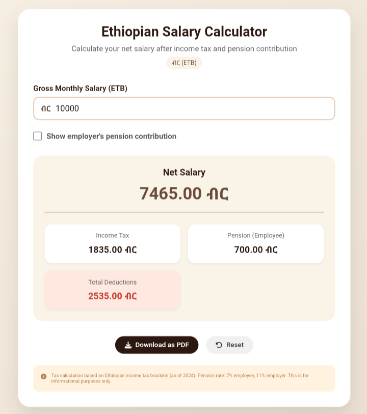
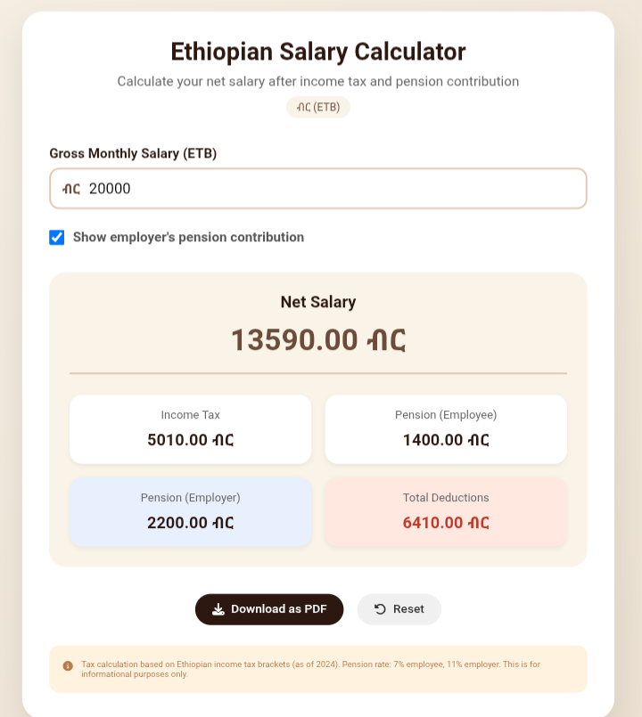

# 💰 Ethiopian Salary Calculator

> A modern web tool to calculate **net monthly salary** after Ethiopian income tax and pension contributions.  
> Built with HTML, CSS, and JavaScript. Works offline and is fully responsive.

🔗 **[Live Demo](https://amardelil.github.io/ethiopian-salary-calculator)**

---

## 📸 Screenshots

| Calculator Interface | Results View |
|:--------------------:|:------------:|
|  |  |

---

## ✨ Features

- ✅ **Real‑time calculation** – updates instantly as you type
- ✅ **Accurate tax brackets** – based on Ethiopian 2024 income tax rates
- ✅ **Pension included** – 7% employee / 11% employer (optional display)
- ✅ **PDF export** – download a summary as a PDF file
- ✅ **Reset button** – revert to the default salary (10,000 ETB)
- ✅ **Clean, responsive design** – works on desktop, tablet, and mobile

---

## 🛠️ Technologies Used

- **HTML5** – structure
- **CSS3** – custom styling, gradients, responsive
- **JavaScript** – calculation logic, DOM manipulation
- **html2pdf.js** – PDF generation
- **Font Awesome** – icons

---

## 📁 Project Structure

```
ethiopian-salary-calculator/
├── taxindex.html          # Main page
├── taxstyle.css           # All styles
├── taxscript.js           # Calculation logic
├── images/                # Screenshots
│   ├── calculator.png
│   └── results.png
└── README.md              # This file
```

---

## 🚀 How to Run Locally

1. **Clone** the repository:
   ```bash
   git clone https://github.com/amardelil/ethiopian-salary-calculator.git
   ```
2. Open `taxindex.html` in any modern browser – no server needed.

---

## 📬 Connect with Me

- **GitHub** – [amardelil](https://github.com/amardelil)
- **Telegram** – [@amardelil](https://t.me/+251992156362)

---

## 📄 License

This project is open‑source under the [MIT License](LICENSE).

---

*Built with ❤️ by Amar Delil*
