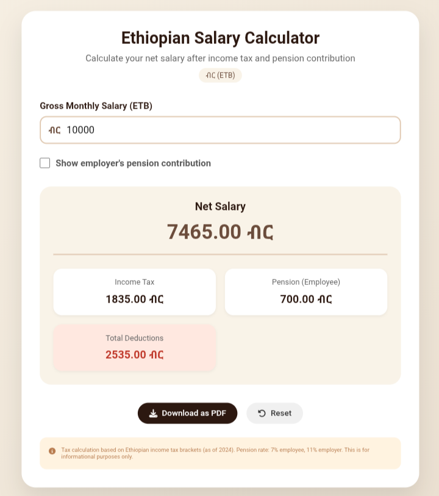
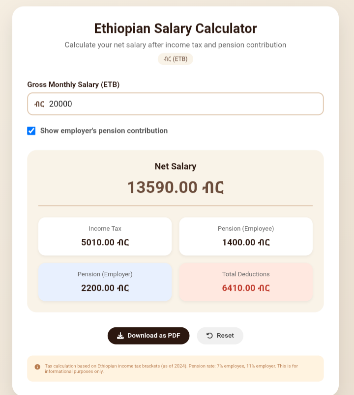

# 💰 Ethiopian Salary Calculator

> A modern web tool to calculate **net monthly salary** after Ethiopian income tax and pension contributions.  
> Built with HTML, CSS, and JavaScript. Works offline and is fully responsive.

🔗 **[Live Demo](https://ethiopian-salary-calculator-sb4r.vercel.app/)**
---

## 📸 Screenshots

| Calculator Interface | Results View |
|:--------------------:|:------------:|
|  | 

---

## 📁 Project Structure

```
ethiopian-salary-calculator/
├── taxindex.html          # Main page
├── taxstyle.css           # All styles
├── taxscript.js           # Calculation logic
├── images/                # Screenshots
│   ├── calculator.png
│   └── results.png
└── README.md              # This file
```

---

## 🚀 How to Run Locally

1. **Clone** the repository:
   ```bash
   git clone https://github.com/amardelil/ethiopian-salary-calculator.git
   ```
2. Open `taxindex.html` in any modern browser – no server needed.

---
